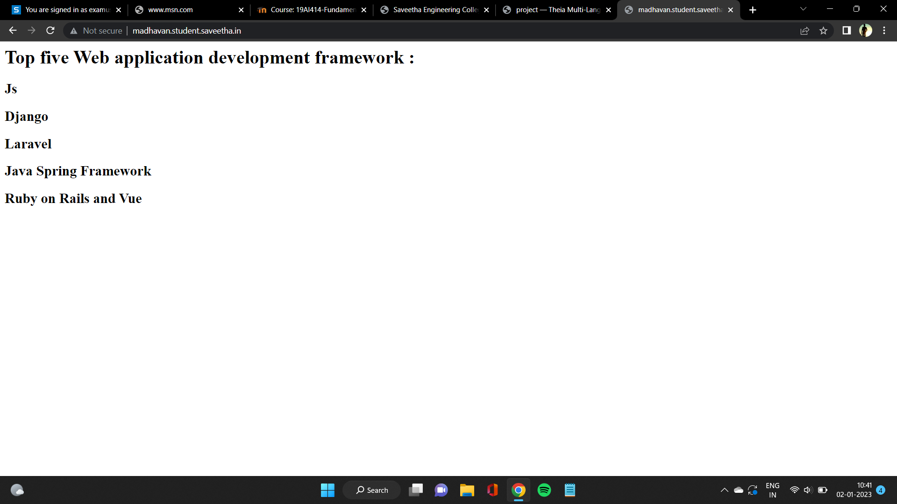

# Developing a Simple Webserver

# AIM:

Name = Madhavan M
Ref = 22007461

# DESIGN STEPS:

## Step 1:

HTML content creation is done

## Step 2:

Design of webserver workflow

## Step 3:

Implementation using Python code

## Step 4:

Serving the HTML pages.

## Step 5:

Testing the webserver

# PROGRAM:
```
from http.server import HTTPServer, BaseHTTPRequestHandler

content = """
<html>
<head>
</head>
<body>
<h1></h1>
<h1>Top five Web application development framework :</h1>
<h2>Js</h2>
<h2>Django</h2>
<h2>Laravel</h2>
<h2>Java Spring Framework</h2>
<h2>Ruby on Rails and Vue</h2>
</body>
</html>
"""

class HelloHandler(BaseHTTPRequestHandler):
    def do_GET(self):
        self.send_response(200)
        self.send_header('Content-type', 'text/html; charset=utf-8')
        self.end_headers()
        self.wfile.write(content.encode())


server_address = ('', 80)
httpd = HTTPServer(server_address, HelloHandler)
httpd.serve_forever()

```

# OUTPUT:


# RESULT:

The program is executed succesfully
